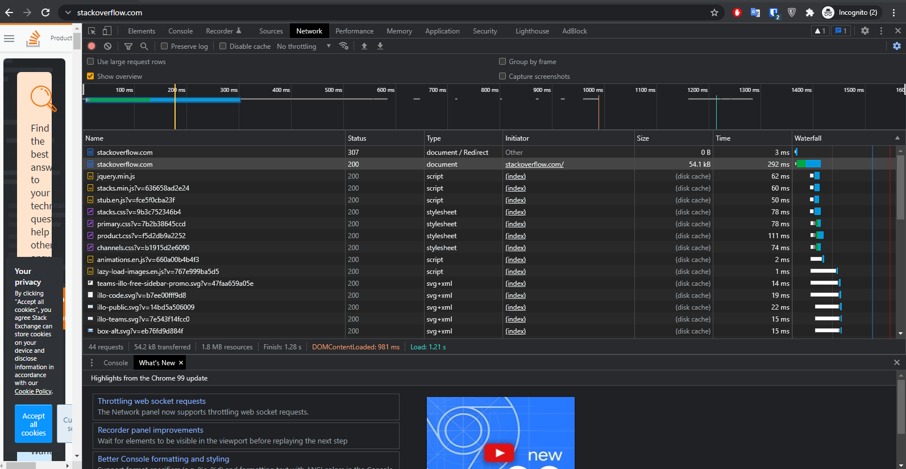

# Домашнее задание к занятию "3.6. Компьютерные сети, лекция 1"

1. Работа c HTTP через телнет.
- Подключитесь утилитой телнет к сайту stackoverflow.com
`telnet stackoverflow.com 80`
- отправьте HTTP запрос
```bash
GET /questions HTTP/1.0
HOST: stackoverflow.com
[press enter]
[press enter]
```
- В ответе укажите полученный HTTP код, что он означает?

  ## Ответ

    HTTP/1.1 301 Moved Permanently
    301 - Означает что хост навсегда переехал по другому адресу
  
  ---

2. Повторите задание 1 в браузере, используя консоль разработчика F12.
- откройте вкладку `Network`
- отправьте запрос http://stackoverflow.com
- найдите первый ответ HTTP сервера, откройте вкладку `Headers`
- укажите в ответе полученный HTTP код.
- проверьте время загрузки страницы, какой запрос обрабатывался дольше всего?
- приложите скриншот консоли браузера в ответ.

  ## Ответ
  
    - очевидно опять 301
    - самый долгий запрос был второй к правильному адресу и загрузкой страницы 292ms
    - 
  ---


3. Какой IP адрес у вас в интернете?
    ## Ответ

    не скажу, а то он у меня белый)
  
  ---
  
4. Какому провайдеру принадлежит ваш IP адрес? Какой автономной системе AS? Воспользуйтесь утилитой `whois`

    ## Ответ
    ```bash
      descr:          AVK-Wellcom Ltd.
      origin:         AS49403
    ```
    ---
  
5. Через какие сети проходит пакет, отправленный с вашего компьютера на адрес 8.8.8.8? Через какие AS? Воспользуйтесь утилитой `traceroute`
    ## Ответ
    ```bash
      vagrant@vagrant:~$ sudo traceroute -IAn 8.8.8.8
      traceroute to 8.8.8.8 (8.8.8.8), 30 hops max, 60 byte packets
       1  10.0.2.2 [*]  0.920 ms  0.810 ms  0.743 ms
       2  192.168.1.1 [*]  2.653 ms  2.068 ms  1.993 ms
       3  172.16.250.138 [*]  3.483 ms  4.250 ms  4.874 ms
       4  172.16.250.38 [*]  5.541 ms  5.427 ms  5.317 ms
       5  178.218.118.85 [AS49403]  5.246 ms  5.872 ms  5.273 ms
       6  178.218.118.74 [AS49403]  5.198 ms  2.414 ms  2.438 ms
       7  37.29.24.49 [AS31133]  4.674 ms  3.489 ms  3.556 ms
       8  72.14.222.181 [AS15169]  3.759 ms  3.766 ms  3.599 ms
       9  108.170.250.66 [AS15169]  4.281 ms  3.693 ms  3.779 ms
      10  * 209.85.255.136 [AS15169]  19.736 ms  23.452 ms
      11  172.253.65.82 [AS15169]  23.110 ms  26.999 ms  21.896 ms
      12  172.253.70.47 [AS15169]  21.107 ms  20.754 ms  20.428 ms
      13  * * *
      14  * * *
      15  * * *
      16  * * *
      17  * * *
      18  * * *
      19  * * *
      20  * * *
      21  * * *
      22  8.8.8.8 [AS15169]  19.072 ms  18.875 ms  18.496 ms
    ```

    ---
  
6. Повторите задание 5 в утилите `mtr`. На каком участке наибольшая задержка - delay?
    ## Ответ
    ```bash
     Host                                                                       Loss%   Snt   Last   Avg  Best  Wrst StDev
   1. AS???    10.0.2.2                                                         0.0%    20    0.6   0.7   0.5   1.6   0.3
   2. AS???    192.168.1.1                                                      0.0%    19    1.8   1.6   1.4   1.8   0.1
   3. AS???    172.16.250.138                                                   0.0%    19    2.3   2.1   1.8   3.8   0.4
   4. AS???    172.16.250.38                                                    5.3%    19    2.2   2.1   1.9   2.5   0.2
   5. AS49403  178.218.118.85                                                   0.0%    19    2.4   2.3   2.0   2.5   0.1
   6. AS49403  178.218.118.74                                                   0.0%    19    2.3   2.3   2.2   2.7   0.2
   7. AS31133  37.29.24.49                                                      0.0%    19    3.5   3.6   3.2   4.9   0.4
   8. AS15169  72.14.222.181                                                    0.0%    19    4.9   4.4   3.6   9.8   1.5
   9. AS15169  108.170.250.66                                                   0.0%    19    4.5   4.5   4.1   5.9   0.4
   10. AS15169  209.85.255.136                                                  38.9%    19   20.1  20.1  19.9  20.6   0.2
   11. AS15169  172.253.65.82                                                   0.0%    19   18.5  26.3  18.2  77.2  16.8
   12. AS15169  172.253.70.47                                                   0.0%    19   18.9  21.1  18.8  49.3   6.9
   13. (waiting for reply)
   14. (waiting for reply)
   15. (waiting for reply)
   16. (waiting for reply)
   17. (waiting for reply)
   18. (waiting for reply)
   19. (waiting for reply)
   20. (waiting for reply)
   21. (waiting for reply)
   22. AS15169  8.8.8.8                                                         0.0%    19   36.9  20.2  18.9  36.9   4.1
   ```
    Так понимаю самый долгий прыжок - AS15169  209.85.255.136
  
  ---
7. Какие DNS сервера отвечают за доменное имя dns.google? Какие A записи? воспользуйтесь утилитой `dig`
    ## Ответ
    ```bash
    dns.google.             10800   IN      NS      ns1.zdns.google.
    dns.google.             10800   IN      NS      ns2.zdns.google.
    dns.google.             10800   IN      NS      ns4.zdns.google.
    dns.google.             10800   IN      NS      ns3.zdns.google.
    ```
    ```bash
    dns.google.             900     IN      A       8.8.4.4
    dns.google.             900     IN      A       8.8.8.8
    ```
---
8. Проверьте PTR записи для IP адресов из задания 7. Какое доменное имя привязано к IP? воспользуйтесь утилитой `dig`
    ## Ответ
    ```bash
    8.8.8.8.in-addr.arpa.   6655    IN      PTR     dns.google.
    4.4.8.8.in-addr.arpa.   19134   IN      PTR     dns.google
    ```
 
---

В качестве ответов на вопросы можно приложите лог выполнения команд в консоли или скриншот полученных результатов.

---

## Как сдавать задания

Обязательными к выполнению являются задачи без указания звездочки. Их выполнение необходимо для получения зачета и диплома о профессиональной переподготовке.

Задачи со звездочкой (*) являются дополнительными задачами и/или задачами повышенной сложности. Они не являются обязательными к выполнению, но помогут вам глубже понять тему.

Домашнее задание выполните в файле readme.md в github репозитории. В личном кабинете отправьте на проверку ссылку на .md-файл в вашем репозитории.

Также вы можете выполнить задание в [Google Docs](https://docs.google.com/document/u/0/?tgif=d) и отправить в личном кабинете на проверку ссылку на ваш документ.
Название файла Google Docs должно содержать номер лекции и фамилию студента. Пример названия: "1.1. Введение в DevOps — Сусанна Алиева".

Если необходимо прикрепить дополнительные ссылки, просто добавьте их в свой Google Docs.

Перед тем как выслать ссылку, убедитесь, что ее содержимое не является приватным (открыто на комментирование всем, у кого есть ссылка), иначе преподаватель не сможет проверить работу. Чтобы это проверить, откройте ссылку в браузере в режиме инкогнито.

[Как предоставить доступ к файлам и папкам на Google Диске](https://support.google.com/docs/answer/2494822?hl=ru&co=GENIE.Platform%3DDesktop)

[Как запустить chrome в режиме инкогнито ](https://support.google.com/chrome/answer/95464?co=GENIE.Platform%3DDesktop&hl=ru)

[Как запустить  Safari в режиме инкогнито ](https://support.apple.com/ru-ru/guide/safari/ibrw1069/mac)

Любые вопросы по решению задач задавайте в чате учебной группы.

---

