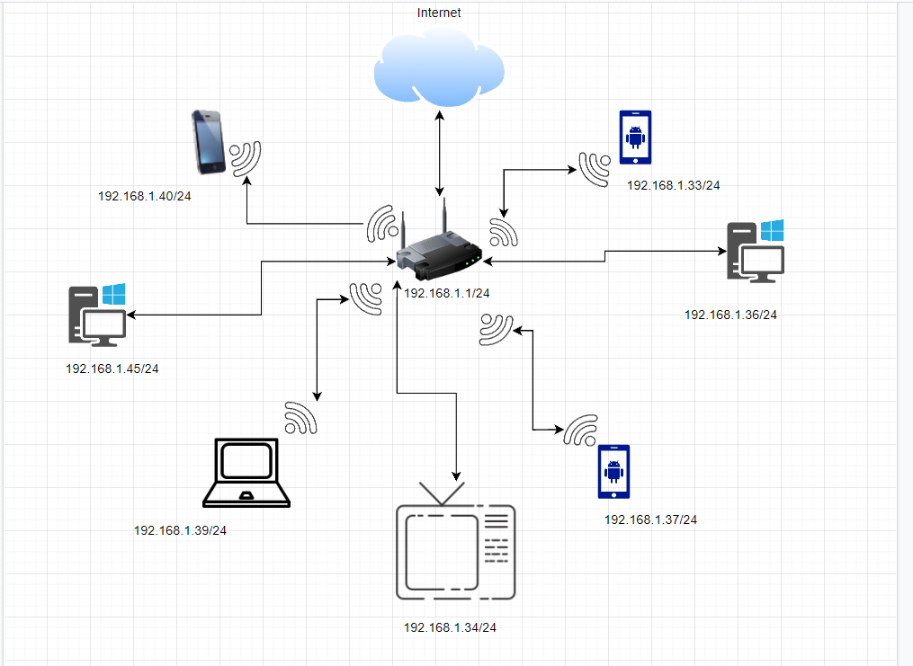

# Домашнее задание к занятию "3.8. Компьютерные сети, лекция 3"

1. Подключитесь к публичному маршрутизатору в интернет. Найдите маршрут к вашему публичному IP
```
telnet route-views.routeviews.org
Username: rviews
show ip route x.x.x.x/32
show bgp x.x.x.x/32
```
   ## Ответ
   ```bash
    route-views>show ip route ***.***.***.148
 Routing entry for ***.***.***.0/24
   Known via "bgp 6447", distance 20, metric 0
   Tag 6939, type external
   Last update from 64.71.137.241 4d14h ago
   Routing Descriptor Blocks:
   * 64.71.137.241, from 64.71.137.241, 4d14h ago
       Route metric is 0, traffic share count is 1
       AS Hops 2
       Route tag 6939
       MPLS label: none
 route-views>show bgp ***.***.***.148
 BGP routing table entry for ***.***.***.0/24, version 1862475493
 Paths: (5 available, best #4, table default)
   Not advertised to any peer
   Refresh Epoch 1
   3267 49403
     194.85.40.15 from 194.85.40.15 (185.141.126.1)
       Origin IGP, metric 0, localpref 100, valid, external
       path 7FE03693C570 RPKI State not found
       rx pathid: 0, tx pathid: 0
   Refresh Epoch 1
   1351 6939 49403
     132.198.255.253 from 132.198.255.253 (132.198.255.253)
       Origin IGP, localpref 100, valid, external
       path 7FE0F966DE70 RPKI State not found
       rx pathid: 0, tx pathid: 0
   Refresh Epoch 1
   3303 6939 49403
     217.192.89.50 from 217.192.89.50 (138.187.128.158)
       Origin IGP, localpref 100, valid, external
       Community: 3303:1006 3303:1021 3303:1030 3303:3067 6939:7154 6939:8233 6939:9002
       path 7FE0CC9C9148 RPKI State not found
       rx pathid: 0, tx pathid: 0
   Refresh Epoch 1
   6939 49403
     64.71.137.241 from 64.71.137.241 (216.218.252.164)
       Origin IGP, localpref 100, valid, external, best
       unknown transitive attribute: flag 0xE0 type 0x20 length 0xC
         value 0000 21B7 0000 0777 0000 21B7
       path 7FE159DAB390 RPKI State not found
       rx pathid: 0, tx pathid: 0x0
   Refresh Epoch 1
   20130 6939 49403
     140.192.8.16 from 140.192.8.16 (140.192.8.16)
       Origin IGP, localpref 100, valid, external
       path 7FE0E8415F30 RPKI State not found
       rx pathid: 0, tx pathid: 0
   ```
   ---
2. Создайте dummy0 интерфейс в Ubuntu. Добавьте несколько статических маршрутов. Проверьте таблицу маршрутизации.
   ## Ответ
   ```bash
   root@vagrant:~# ip link add dummy0 type dummy
   root@vagrant:~# sudo ip addr add 10.0.29.0/24 dev dummy0
   root@vagrant:~# sudo ip link set dummy0 up
   root@vagrant:~#
   root@vagrant:~# ip address
   1: lo: <LOOPBACK,UP,LOWER_UP> mtu 65536 qdisc noqueue state UNKNOWN group default qlen 1000
       link/loopback 00:00:00:00:00:00 brd 00:00:00:00:00:00
       inet 127.0.0.1/8 scope host lo
          valid_lft forever preferred_lft forever
       inet6 ::1/128 scope host
          valid_lft forever preferred_lft forever
   2: eth0: <BROADCAST,MULTICAST,UP,LOWER_UP> mtu 1500 qdisc fq_codel state UP group default qlen 1000
       link/ether 08:00:27:b1:28:5d brd ff:ff:ff:ff:ff:ff
       inet 10.0.2.15/24 brd 10.0.2.255 scope global dynamic eth0
          valid_lft 83216sec preferred_lft 83216sec
       inet6 fe80::a00:27ff:feb1:285d/64 scope link
          valid_lft forever preferred_lft forever
   3: dummy0: <BROADCAST,NOARP,UP,LOWER_UP> mtu 1500 qdisc noqueue state UNKNOWN group default qlen 1000
       link/ether d6:49:c6:fb:ba:fa brd ff:ff:ff:ff:ff:ff
       inet 10.0.29.0/24 scope global dummy0
          valid_lft forever preferred_lft forever
       inet6 fe80::d449:c6ff:fefb:bafa/64 scope link
          valid_lft forever preferred_lft forever
   root@vagrant:~# ip route add 8.8.8.0/24 via 10.0.2.1
   root@vagrant:~# ip route add 8.16.28.0/24 via 10.0.29.0
   root@vagrant:~# ip route
   default via 10.0.2.2 dev eth0 proto dhcp src 10.0.2.15 metric 100
   8.8.8.0/24 via 10.0.2.1 dev eth0
   8.16.28.0/24 via 10.0.29.0 dev dummy0
   10.0.2.0/24 dev eth0 proto kernel scope link src 10.0.2.15
   10.0.2.2 dev eth0 proto dhcp scope link src 10.0.2.15 metric 100
   10.0.29.0/24 dev dummy0 proto kernel scope link src 10.0.29.0
   root@vagrant:~#
   ```
   ---
3. Проверьте открытые TCP порты в Ubuntu, какие протоколы и приложения используют эти порты? Приведите несколько примеров.
   ## Ответ
   ```bash
   root@vagrant:~# ss -tpan
   State         Recv-Q        Send-Q                 Local Address:Port                 Peer Address:Port         Process
   LISTEN        0             4096                   127.0.0.53%lo:53                        0.0.0.0:*             users:(("systemd-resolve",pid=608,fd=13))
   LISTEN        0             128                          0.0.0.0:22                        0.0.0.0:*             users:(("sshd",pid=692,fd=3))
   ESTAB         0             0                          10.0.2.15:22                       10.0.2.2:58779         users:(("sshd",pid=1307,fd=4),("sshd",pid=1260,fd=4))
   LISTEN        0             128                             [::]:22                           [::]:*             users:(("sshd",pid=692,fd=4))
   root@vagrant:~#
   
   ```
   
   22 - port ssh, использует sshd
   53 - DNS, в моем случае использует systemd-resolve вероятно для резовла и днс запросов
   ---
5. Проверьте используемые UDP сокеты в Ubuntu, какие протоколы и приложения используют эти порты?
   ## Ответ
   ```bash
   root@vagrant:~# ss -upan
   State           Recv-Q          Send-Q                    Local Address:Port                   Peer Address:Port          Process
   UNCONN          0               0                         127.0.0.53%lo:53                          0.0.0.0:*              users:(("systemd-resolve",pid=608,fd=12))
   UNCONN          0               0                        10.0.2.15%eth0:68                          0.0.0.0:*              users:(("systemd-network",pid=606,fd=19))
   ```
   
   
   53 - опять DNS
   68 - dhcp, у меня на убунту это как видно stemd-network
   ---
5. Используя diagrams.net, создайте L3 диаграмму вашей домашней сети или любой другой сети, с которой вы работали. 
   
   
   
 ---
## Задание для самостоятельной отработки (необязательно к выполнению)

6*. Установите Nginx, настройте в режиме балансировщика TCP или UDP.

7*. Установите bird2, настройте динамический протокол маршрутизации RIP.

8*. Установите Netbox, создайте несколько IP префиксов, используя curl проверьте работу API.

 ---

## Как сдавать задания

Обязательными к выполнению являются задачи без указания звездочки. Их выполнение необходимо для получения зачета и диплома о профессиональной переподготовке.

Задачи со звездочкой (*) являются дополнительными задачами и/или задачами повышенной сложности. Они не являются обязательными к выполнению, но помогут вам глубже понять тему.

Домашнее задание выполните в файле readme.md в github репозитории. В личном кабинете отправьте на проверку ссылку на .md-файл в вашем репозитории.

Также вы можете выполнить задание в [Google Docs](https://docs.google.com/document/u/0/?tgif=d) и отправить в личном кабинете на проверку ссылку на ваш документ.
Название файла Google Docs должно содержать номер лекции и фамилию студента. Пример названия: "1.1. Введение в DevOps — Сусанна Алиева".

Если необходимо прикрепить дополнительные ссылки, просто добавьте их в свой Google Docs.

Перед тем как выслать ссылку, убедитесь, что ее содержимое не является приватным (открыто на комментирование всем, у кого есть ссылка), иначе преподаватель не сможет проверить работу. Чтобы это проверить, откройте ссылку в браузере в режиме инкогнито.

[Как предоставить доступ к файлам и папкам на Google Диске](https://support.google.com/docs/answer/2494822?hl=ru&co=GENIE.Platform%3DDesktop)

[Как запустить chrome в режиме инкогнито ](https://support.google.com/chrome/answer/95464?co=GENIE.Platform%3DDesktop&hl=ru)

[Как запустить  Safari в режиме инкогнито ](https://support.apple.com/ru-ru/guide/safari/ibrw1069/mac)

Любые вопросы по решению задач задавайте в чате Slack.

---
